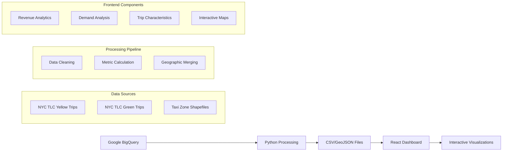

# NYC Taxi Analytics Dashboard

[](https://reactjs.org/)
[](https://www.typescriptlang.org/)
[](https://mui.com/)
[](https://vitejs.dev/)
[](https://opensource.org/licenses/MIT)

A comprehensive end-to-end data analytics platform that processes NYC taxi trip data from Google BigQuery and presents actionable insights through an interactive React dashboard. This project combines big data processing with modern web visualization to explore transportation patterns, revenue metrics, and geographic distributions across New York City's 263 taxi zones.

## Live Demo

🚀 **[View Live Dashboard](https://www.nyc-taxi-dashboard.com)**

## 🌟 Key Features

### 📊 **Interactive Analytics**
- **Dynamic Heatmaps** - Color-coded zones with real-time metric switching
- **Temporal Analysis** - Trip patterns across 30-minute intervals
- **Flow Visualization** - Sankey diagrams showing pickup-dropoff relationships
- **Revenue Insights** - Financial metrics and tipping patterns

### 🗺️ **Geographic Intelligence**
- **263 NYC Taxi Zones** - Complete coverage across all five boroughs
- **Interactive Maps** - Powered by React Leaflet with custom styling
- **Zone-based Metrics** - Neighborhood-level granular analysis
- **Coordinate Precision** - Proper WGS84 projection handling

### 🎨 **Modern UI/UX**
- **Material-UI v7** - Professional design system
- **Dark/Light Themes** - Automatic mode switching
- **Responsive Design** - Mobile-first approach
- **Performance Optimized** - Lazy loading and efficient rendering

## 🏗️ Architecture Overview



## 📊 Data Pipeline

### **Data Sources**
- **Primary**: Google BigQuery public dataset (`bigquery-public-data.new_york_taxi_trips`)
- **Geographic**: NYC TLC official taxi zone shapefiles (263 zones)
- **Temporal Coverage**: Configurable date ranges (default: Jan-Feb 2025)
- **Trip Types**: Yellow and Green taxi services

### **Generated Metrics**
| Metric | Description | Use Case |
|--------|-------------|----------|
| `avg_tip_amount.csv` | Average tip amounts by zone | Revenue optimization |
| `avg_total_amount.csv` | Average trip costs | Price analysis |
| `revenue_per_pickup.csv` | Total revenue by zone | Business intelligence |
| `trips_by_time_of_day.csv` | Temporal trip patterns | Demand forecasting |
| `duration_by_time_of_day.csv` | Trip duration analysis | Traffic insights |
| `dropoff_by_pickup_*.csv` | Origin-destination flows | Route optimization |
| `merged.geojson` | Geographic boundaries + metrics | Map visualization |

### **Processing Features**
- ✅ **BigQuery Integration** - Serverless SQL processing at scale
- ✅ **Automated Data Cleaning** - Missing value handling and validation
- ✅ **Coordinate Transformation** - EPSG:2263 to WGS84 conversion
- ✅ **Performance Optimization** - Partitioned queries and efficient aggregation

## 🖥️ Frontend Technology Stack

### **Core Framework**
```json
{
  "react": "^19.1.1",
  "typescript": "~5.8.3",
  "vite": "^7.1.2"
}
```

### **UI & Visualization**
```json
{
  "@mui/material": "^7.3.2",
  "plotly.js": "^3.1.0",
  "react-leaflet": "^5.0.0",
  "chroma-js": "^3.1.2"
}
```

### **Development & Build**
```json
{
  "eslint": "^9.33.0",
  "typescript-eslint": "^8.39.1",
  "@vitejs/plugin-react-swc": "^4.0.0"
}
```

## 🚀 Quick Start

### **Prerequisites**
- **Node.js** >= 18.0.0
- **npm** >= 9.0.0
- **Python** >= 3.8 (for data processing)
- **Google Cloud Account** (for BigQuery access)

### **1. Clone & Install**
```bash
# Clone the repository
git clone https://github.com/amirrezaskh/nyc-taxi-dashboard.git
cd nyc-taxi-dashboard

# Install dependencies
npm install
```

### **3. Data Processing (Optional)**
If you want to regenerate the data from BigQuery:

```bash
# Install Python dependencies
pip install pandas numpy matplotlib folium geopandas google-cloud-bigquery

# Set up Google Cloud authentication
export GOOGLE_APPLICATION_CREDENTIALS="path/to/service-account-key.json"

# Run data processing
jupyter notebook processing/main.ipynb
```

### **4. Development Server**
```bash
# Start development server
npm run dev

# Open browser at http://localhost:5173
```

## 📁 Project Structure

```
nyc-taxi-dashboard/
├── 📂 public/                     # Static assets and processed data
│   ├── 📊 data/                   # CSV files and GeoJSON
│   │   ├── avg_tip_amount.csv
│   │   ├── trips_by_time_of_day.csv
│   │   ├── merged.geojson
│   │   └── ...
│   └── 🖼️ favicon.ico
├── 📂 src/
│   ├── 📂 app/                    # Application core
│   │   ├── layout/               # Layout components
│   │   │   ├── App.tsx          # Main app wrapper
│   │   │   ├── Navbar.tsx       # Navigation
│   │   │   └── styles.css       # Global styles
│   │   └── router/              # Routing configuration
│   │       └── routes.tsx       # Route definitions
│   ├── 📂 features/              # Feature-based architecture
│   │   ├── about/               # About page
│   │   ├── revenue/             # Revenue analytics
│   │   │   └── RevenueTips.tsx
│   │   ├── demand/              # Trip demand analysis
│   │   │   ├── Demand.tsx
│   │   │   ├── TripsByTime.tsx
│   │   │   └── TaxiSankey.tsx
│   │   ├── characteristic/      # Trip characteristics
│   │   │   ├── TripCharacteristic.tsx
│   │   │   └── DurationByTime.tsx
│   │   └── map/                 # Interactive mapping
│   │       └── NYCMap.tsx
│   ├── 📂 theme/                 # Design system
│   │   ├── AppTheme.tsx         # Theme provider
│   │   ├── palettes.ts          # Color schemes
│   │   ├── themePrimitives.ts   # Design tokens
│   │   └── customizations/      # Component overrides
│   ├── 📂 lib/                   # Utilities and types
│   │   ├── types/
│   │   └── util/
│   └── main.tsx                 # Application entry point
├── 📂 processing/                # Data analysis pipeline
│   ├── main.ipynb              # Primary analysis notebook
│   ├── preprocess.ipynb        # Data preprocessing
│   ├── process.py              # Zone processing script
│   └── merge.py                # Data merging script
├── 📄 package.json             # Dependencies and scripts
├── 📄 tsconfig.json            # TypeScript configuration
├── 📄 vite.config.ts           # Vite build configuration
└── 📄 README.md                # This file
```

## 🎨 Dashboard Sections

### **1. Revenue & Tips Analysis**
Explore the financial landscape of NYC's taxi ecosystem:

- **Manhattan Premium** - Higher tips in business districts
- **Airport Revenue** - JFK/LaGuardia pickup patterns
- **Tip Percentage Trends** - Business vs entertainment zones
- **Economic Geography** - Revenue concentration analysis

**Key Metrics**: Average tip amount, total revenue, tip percentages

### **2. Trip Demand Analysis** 
Understand dynamic patterns of taxi utilization:

- **Rush Hour Peaks** - Morning (7-9 AM) and evening (5-7 PM) patterns
- **Weekend Shifts** - Late-night entertainment district activity
- **Commuter Flows** - Directional pickup/dropoff relationships
- **Seasonal Variations** - Weather and event impact analysis

**Visualizations**: Time series charts, Sankey flow diagrams, demand heatmaps

### **3. Trip Characteristics**
Analyze fundamental trip attributes:

- **Passenger Patterns** - Business (1.2-1.4) vs entertainment (1.6-2.0) occupancy
- **Distance Variations** - Airport vs intra-Manhattan comparisons
- **Duration Dynamics** - Traffic impact (40-60% longer in rush hour)
- **Geographic Influence** - Bridge/tunnel access effects

**Components**: Duration analysis, distance distributions, passenger metrics


## 📄 License

This project is licensed under the MIT License - see the [LICENSE](LICENSE) file for details.
